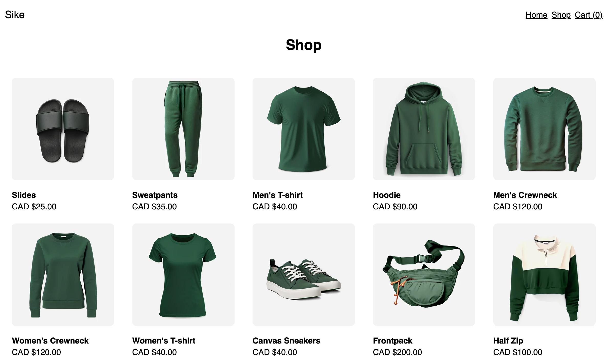

# Sike

My implementation of the [shopping cart project](https://www.theodinproject.com/lessons/node-path-react-new-shopping-cart) for [The Odin Project](https://www.theodinproject.com/). Check out the [live preview](https://shop-sike.vercel.app/)!

## Description

This is a mock shopping website, built using React and styled with styled-components. The main goals of the project were to become more familiar with React testing and React router. I set up the application using Vite and deployed it with Vercel.

## Features

- Allows user to navigate between home, shop, product and cart pages
- Fetches and displays product data from [Mock.shop API](https://mock.shop/)
- Validates product quantity input when adding to cart
- Handles routing as a single page application (SPA)
- Uses `localStorage` so that items in cart persist between browser sessions

## I learned how to:

- Test UI elements and simulate user events using Vitest and Testing Library
- Mock functions such as `window.fetch`
- Create and use a custom hook
- Style React applications with styled-components
- Type check the props that a component receives using PropTypes
- Use React Router to specify which component is rendered based on route
- Use `useParams` and dynamic segments to render content according to the URL

## Acknowledgements

Product data from [Mock.shop API](https://mock.shop/).

[Favicon](https://favicon.io/emoji-favicons/shopping-cart/) from [favicon.io](https://favicon.io/).
